# baye

霸业

## springboot

### web

#### rest接口

#### Spring Boot非Web项目运行的方法

参考 [Spring Boot非Web项目运行的方法](https://www.jb51.net/article/169744.htm)

spring-boot-starter-web -> spring-boot-starter

```xml

<dependency>
    <groupId>org.springframework.boot</groupId>
    <artifactId>spring-boot-starter</artifactId>
    <exclusions>
        <exclusion>
            <artifactId>spring-boot-starter-logging</artifactId>
            <groupId>org.springframework.boot</groupId>
        </exclusion>
    </exclusions>
</dependency>
```

只运行一次就结束 如果想要不停止 可以实现 CommandLineRunner 重写 run方法为 @Override public void run(String... args) throws Exception {
Thread.currentThread().join(); }

### 日志

#### 日志门面

常见的有：

日志门面 :

- JCL
- slf4j

日志实现 :

- JUL
- logback
- log4j
- log4j2

日志实现有些实现了多个日志门面

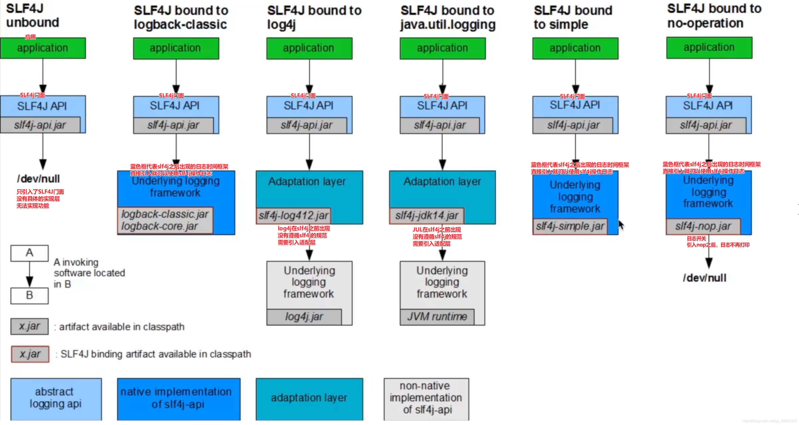

#### springboot 引入 log4j2

还没引入之前日志

```text

  .   ____          _            __ _ _
 /\\ / ___'_ __ _ _(_)_ __  __ _ \ \ \ \
( ( )\___ | '_ | '_| | '_ \/ _` | \ \ \ \
 \\/  ___)| |_)| | | | | || (_| |  ) ) ) )
  '  |____| .__|_| |_|_| |_\__, | / / / /
 =========|_|==============|___/=/_/_/_/
 :: Spring Boot ::                (v2.4.5)

2021-05-22 19:43:52.577  INFO 19252 --- [           main] c.g.c.h.s.SpringBootLearnApplication     : Starting SpringBootLearnApplication using Java 1.8.0_202 on DESKTOP-6ANCF3P with PID 19252 (D:\learn\experiment\Java\learn\spring-boot-learn\target\classes started by hong in D:\learn\experiment\Java\learn)
2021-05-22 19:43:52.579  INFO 19252 --- [           main] c.g.c.h.s.SpringBootLearnApplication     : No active profile set, falling back to default profiles: default
2021-05-22 19:43:53.140  INFO 19252 --- [           main] o.s.b.w.embedded.tomcat.TomcatWebServer  : Tomcat initialized with port(s): 8080 (http)
2021-05-22 19:43:53.146  INFO 19252 --- [           main] o.apache.catalina.core.StandardService   : Starting service [Tomcat]
2021-05-22 19:43:53.146  INFO 19252 --- [           main] org.apache.catalina.core.StandardEngine  : Starting Servlet engine: [Apache Tomcat/9.0.45]
2021-05-22 19:43:53.147  INFO 19252 --- [           main] o.a.catalina.core.AprLifecycleListener   : An older version [1.2.21] of the Apache Tomcat Native library is installed, while Tomcat recommends a minimum version of [1.2.23]
2021-05-22 19:43:53.147  INFO 19252 --- [           main] o.a.catalina.core.AprLifecycleListener   : Loaded Apache Tomcat Native library [1.2.21] using APR version [1.6.5].
2021-05-22 19:43:53.147  INFO 19252 --- [           main] o.a.catalina.core.AprLifecycleListener   : APR capabilities: IPv6 [true], sendfile [true], accept filters [false], random [true].
2021-05-22 19:43:53.147  INFO 19252 --- [           main] o.a.catalina.core.AprLifecycleListener   : APR/OpenSSL configuration: useAprConnector [false], useOpenSSL [true]
2021-05-22 19:43:53.149  INFO 19252 --- [           main] o.a.catalina.core.AprLifecycleListener   : OpenSSL successfully initialized [OpenSSL 1.1.1a  20 Nov 2018]
2021-05-22 19:43:53.194  INFO 19252 --- [           main] o.a.c.c.C.[Tomcat].[localhost].[/]       : Initializing Spring embedded WebApplicationContext
2021-05-22 19:43:53.194  INFO 19252 --- [           main] w.s.c.ServletWebServerApplicationContext : Root WebApplicationContext: initialization completed in 582 ms
 food : Food{meet='beef', fruit='apple', vegetable='tomato', drink='milk'}
2021-05-22 19:43:53.305  INFO 19252 --- [           main] o.s.s.concurrent.ThreadPoolTaskExecutor  : Initializing ExecutorService 'applicationTaskExecutor'
2021-05-22 19:43:53.411  INFO 19252 --- [           main] o.s.b.w.embedded.tomcat.TomcatWebServer  : Tomcat started on port(s): 8080 (http) with context path ''
2021-05-22 19:43:53.418  INFO 19252 --- [           main] c.g.c.h.s.SpringBootLearnApplication     : Started SpringBootLearnApplication in 1.131 seconds (JVM running for 1.838)
MyApplicationRunner class will be execute when the project was started!
```

修改后

```text

  .   ____          _            __ _ _
 /\\ / ___'_ __ _ _(_)_ __  __ _ \ \ \ \
( ( )\___ | '_ | '_| | '_ \/ _` | \ \ \ \
 \\/  ___)| |_)| | | | | || (_| |  ) ) ) )
  '  |____| .__|_| |_|_| |_\__, | / / / /
 =========|_|==============|___/=/_/_/_/
 :: Spring Boot ::                (v2.4.5)

19:53:04.651 [main] [INFO ] cn.gd.cz.hong.springbootlearn.SpringBootLearnApplication:55 --- Starting SpringBootLearnApplication using Java 1.8.0_202 on DESKTOP-6ANCF3P with PID 19744 (D:\learn\experiment\Java\learn\spring-boot-learn\target\classes started by hong in D:\learn\experiment\Java\learn)
19:53:04.657 [main] [INFO ] cn.gd.cz.hong.springbootlearn.SpringBootLearnApplication:675 --- No active profile set, falling back to default profiles: default
19:53:05.198 [main] [INFO ] org.springframework.boot.web.embedded.tomcat.TomcatWebServer:108 --- Tomcat initialized with port(s): 8080 (http)
19:53:05.208 [main] [INFO ] org.apache.coyote.http11.Http11NioProtocol:173 --- Initializing ProtocolHandler ["http-nio-8080"]
19:53:05.208 [main] [INFO ] org.apache.catalina.core.StandardService:173 --- Starting service [Tomcat]
19:53:05.209 [main] [INFO ] org.apache.catalina.core.StandardEngine:173 --- Starting Servlet engine: [Apache Tomcat/9.0.45]
19:53:05.210 [main] [INFO ] org.apache.catalina.core.AprLifecycleListener:173 --- An older version [1.2.21] of the Apache Tomcat Native library is installed, while Tomcat recommends a minimum version of [1.2.23]
19:53:05.210 [main] [INFO ] org.apache.catalina.core.AprLifecycleListener:173 --- Loaded Apache Tomcat Native library [1.2.21] using APR version [1.6.5].
19:53:05.210 [main] [INFO ] org.apache.catalina.core.AprLifecycleListener:173 --- APR capabilities: IPv6 [true], sendfile [true], accept filters [false], random [true].
19:53:05.210 [main] [INFO ] org.apache.catalina.core.AprLifecycleListener:173 --- APR/OpenSSL configuration: useAprConnector [false], useOpenSSL [true]
19:53:05.212 [main] [INFO ] org.apache.catalina.core.AprLifecycleListener:173 --- OpenSSL successfully initialized [OpenSSL 1.1.1a  20 Nov 2018]
19:53:05.255 [main] [INFO ] org.apache.catalina.core.ContainerBase.[Tomcat].[localhost].[/]:173 --- Initializing Spring embedded WebApplicationContext
19:53:05.255 [main] [INFO ] org.springframework.boot.web.servlet.context.ServletWebServerApplicationContext:289 --- Root WebApplicationContext: initialization completed in 541 ms
 food : Food{meet='beef', fruit='apple', vegetable='tomato', drink='milk'}
19:53:05.354 [main] [INFO ] org.springframework.scheduling.concurrent.ThreadPoolTaskExecutor:181 --- Initializing ExecutorService 'applicationTaskExecutor'
19:53:05.448 [main] [INFO ] org.apache.coyote.http11.Http11NioProtocol:173 --- Starting ProtocolHandler ["http-nio-8080"]
19:53:05.460 [main] [INFO ] org.springframework.boot.web.embedded.tomcat.TomcatWebServer:220 --- Tomcat started on port(s): 8080 (http) with context path ''
19:53:05.467 [main] [INFO ] cn.gd.cz.hong.springbootlearn.SpringBootLearnApplication:61 --- Started SpringBootLearnApplication in 1.074 seconds (JVM running for 2.001)
MyApplicationRunner class will be execute when the project was started!
```

1. 引入 spring-boot-starter-log4j2

```xml

<dependency>
    <groupId>org.springframework.boot</groupId>
    <artifactId>spring-boot-starter-log4j2</artifactId>
</dependency>
```

直接启动会出现下面这个报错 虽然不影响启动 但是启动爆这个错总感觉哪里不对劲

```text
SLF4J: Class path contains multiple SLF4J bindings.
SLF4J: Found binding in [jar:file:/D:/app/code/maven/repository/ch/qos/logback/logback-classic/1.2.3/logback-classic-1.2.3.jar!/org/slf4j/impl/StaticLoggerBinder.class]
SLF4J: Found binding in [jar:file:/D:/app/code/maven/repository/org/apache/logging/log4j/log4j-slf4j-impl/2.13.3/log4j-slf4j-impl-2.13.3.jar!/org/slf4j/impl/StaticLoggerBinder.class]
SLF4J: See http://www.slf4j.org/codes.html#multiple_bindings for an explanation.
SLF4J: Actual binding is of type [ch.qos.logback.classic.util.ContextSelectorStaticBinder]
```

排查
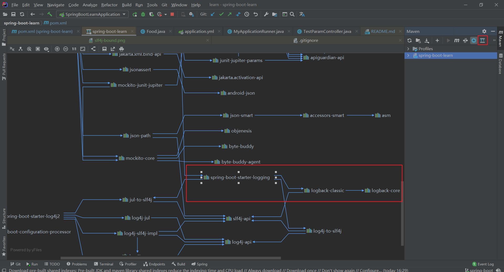

排除后 自动使用的原因
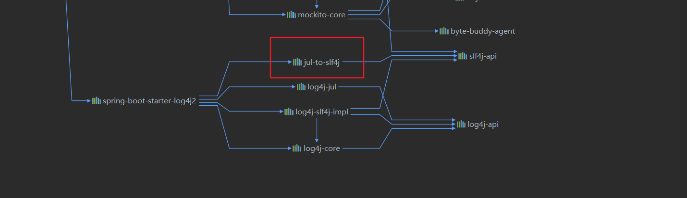

最后使用的日志框架参照
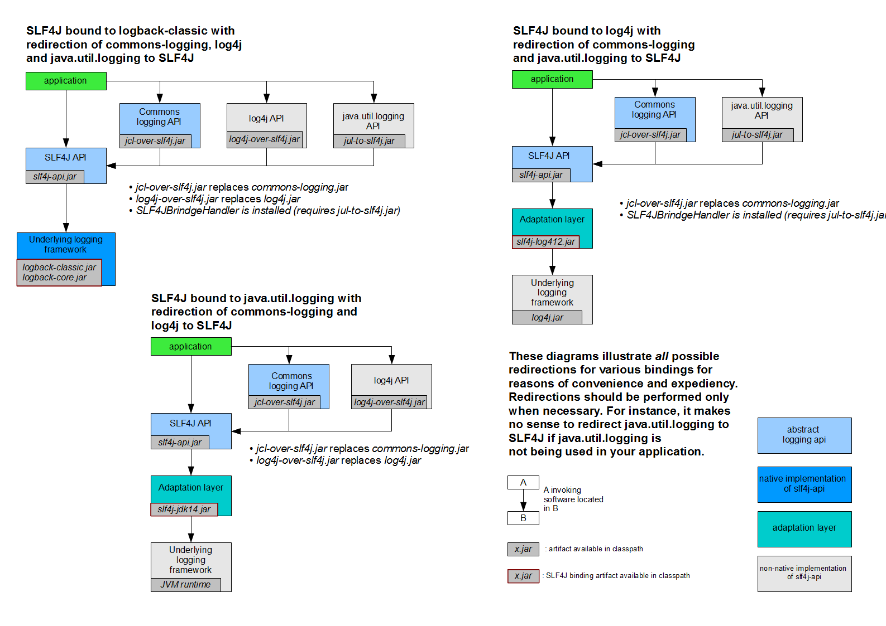

##### 桥接模式

主要思想： 将继承关系转化为组合关系

### database

#### MySQL

首先你本地要安装好MySQL 这里不做赘述

1. 引入jdbc starter 还有就是MySQL驱动

```xml

<dependency>
    <groupId>org.springframework.boot</groupId>
    <artifactId>spring-boot-starter-jdbc</artifactId>
</dependency>
<dependency>
<groupId>mysql</groupId>
<artifactId>mysql-connector-java</artifactId>
</dependency>
```

2. application.yml 增加配置

```yaml
spring:
  datasource:
    driver-class-name: com.mysql.cj.jdbc.Driver
    password: 123
    url: jdbc:mysql://127.0.0.1:3306/test?useUnicode=true&characterEncoding=UTF-8&serverTimezone=Asia/Shanghai
    username: root
```

#### druid

1. 添加druid-spring-boot-starter

```xml

<dependency>
    <groupId>com.alibaba</groupId>
    <artifactId>druid-spring-boot-starter</artifactId>
    <version>1.1.10</version>
</dependency>
```

2. application.yaml 添加配置

```yaml
spring:
  # 数据源配置
  # MYSQL 5 驱动：com.mysql.jdbc.Driver，MYSQL 6+ 驱动：com.mysql.cj.jdbc.Driver
  datasource:
    type: "com.alibaba.druid.pool.DruidDataSource"
    driver-class-name: com.mysql.cj.jdbc.Driver
    url: jdbc:mysql://127.0.0.1:3306/test?useUnicode=true&characterEncoding=UTF-8&serverTimezone=Asia/Shanghai
    username: root
    password: 123
    # 连接池配置
    druid:
      # 初始化大小，最小，最大
      initial-size: 5
      min-idle: 5
      max-active: 20
      # 配置获取连接等待超时的时间
      max-wait: 60000
      # 配置间隔多久才进行一次检测，检测需要关闭的空闲连接，单位毫秒
      time-between-eviction-runs-millis: 60000
      # 配置一个连接在池中最小生存时间
      min-evictable-idle-time-millis: 300000
      validation-query: SELECT 1 FROM sys_user
      test-while-idle: true
      test-on-borrow: false
      test-on-return: false
      # 打开 PSCache，并且指定每个连接上 PSCache 的大小
      pool-prepared-statements: true
      max-pool-prepared-statement-per-connection-size: 20
      # 配置监控统计拦截的 Filter，去掉后监控界面 SQL 无法统计，wall 用于防火墙
      filters: stat,wall,log4j2
      # 通过 connection-properties 属性打开 mergeSql 功能；慢 SQL 记录
      connection-properties: druid.stat.mergeSql\=true;druid.stat.slowSqlMillis\=5000
      # 配置 DruidStatFilter
      web-stat-filter:
        enabled: true
        url-pattern: /*
        exclusions: .js,*.gif,*.jpg,*.bmp,*.png,*.css,*.ico,/druid/*
      # 配置 DruidStatViewServlet
      stat-view-servlet:
        url-pattern: /druid/*
        # IP 白名单，没有配置或者为空，则允许所有访问
        allow: 127.0.0.1
        # IP 黑名单，若白名单也存在，则优先使用
        deny: 192.168.31.253
        # 禁用 HTML 中 Reset All 按钮
        reset-enable: false
        # 登录用户名/密码
        login-username: root
        login-password: 123
```

这里出现一个错误 SPRING BOOT :NO CONVERTER FOUND CAPABLE OF CONVERTING FROM TYPE [JAVA.LANG.STRING] TO TYPE
可以参考 [SPRING BOOT :NO CONVERTER FOUND CAPABLE OF CONVERTING FROM TYPE -JAVA.LANG.STRING- TO TYPE](https://www.freesion.com/article/1986388352/)

# 配置监控统计拦截的 Filter，去掉后监控界面 SQL 无法统计，wall 用于防火墙

      filters: stat,wall,log4j2

这里的配置 log4j2 估计跟换了日志框架 log4j2 有关 这里需要注意一下

druid 配置参考
[SpringBoot 三种方式配置 Druid](https://www.cnblogs.com/yjq520/p/10779356.html)

#### mybatis

1. 导入 mybatis-spring-boot-starter jar 包

```xml

<dependency>
    <groupId>org.mybatis.spring.boot</groupId>
    <artifactId>mybatis-spring-boot-starter</artifactId>
    <version>2.1.4</version>
</dependency>
```

2. 配置 实体类跟配置文件的位置

```yaml
mybatis:
  # 实体类
  type-aliases-package: cn.gd.cz.hong.springbootlearn.entity
  # 配置文件
  mapper-locations: mapper/*/*Mapper.xml

```

3. 启动类配置扫描mapper

```java
@MapperScan("cn.gd.cz.hong.springbootlearn.dao")
```

4. 编写接口

```java

@Mapper
public interface UserDao {

    User selectById(String id);
}
```

5. 编写sql

```xml
<?xml version="1.0" encoding="UTF-8" ?>
<!DOCTYPE mapper PUBLIC "-//mybatis.org//DTD Mapper 3.0//EN" "http://mybatis.org/dtd/mybatis-3-mapper.dtd" >
<mapper namespace="cn.gd.cz.hong.springbootlearn.dao.UserDao">
    <resultMap id="BaseResultMap" type="cn.gd.cz.hong.springbootlearn.entity.User">
        <id column="id" property="id" jdbcType="VARCHAR"/>
        <result column="name" property="name" jdbcType="VARCHAR"/>
        <result column="password" property="password" jdbcType="VARCHAR"/>
        <result column="birthday" property="birthday" jdbcType="VARCHAR"/>
    </resultMap>
    <sql id="Base_Column_List">
        id, name, password, birthday
    </sql>
    <select id="selectById" resultMap="BaseResultMap" parameterType="java.lang.String">
        select
        <include refid="Base_Column_List"/>
        from user
        where id = #{id}
    </select>
</mapper>
```

参考[SpringBoot 整合 Mybatis 和 Mysql （详细版）](https://www.cnblogs.com/wangzh1guo/p/9996526.html)

6. 自测

```java
private static final Logger LOGGER=
        LoggerFactory.getLogger(UserController.class);

@Autowired
    UserDao userDao;

@PostConstruct
public void init(){
        User user=userDao.selectById("1");
        LOGGER.info("user : {}",user);
        }
```

#### mybatis-plus

学它 [MyBatis-Plus 用起来真的很舒服](https://www.cnblogs.com/l-y-h/p/12859477.html)

##### 初识

添加pom.xml

```xml

<dependency>
    <groupId>com.baomidou</groupId>
    <artifactId>mybatis-plus-boot-starter</artifactId>
    <version>3.4.2</version>
</dependency>
```

mapper 只要集成 BaseMapper 就可以使用默认的方法 泛型的类 = 实体类 = 用于mybatis-plus时 类名小写即是表名 可参见 UserMapper

##### 自动生成代码

添加 pom.xml

```xml
<!-- 自动生成代码 -->
<dependency>
    <groupId>com.baomidou</groupId>
    <artifactId>mybatis-plus-generator</artifactId>
    <version>3.4.1</version>
</dependency>
        <!-- 添加 模板引擎 依赖 -->
<dependency>
<groupId>org.apache.velocity</groupId>
<artifactId>velocity-engine-core</artifactId>
<version>2.3</version>
</dependency>
        <!-- 这里限制了版本号 是因为高版本的没有了类 自动生成类会报错-->
<dependency>
<groupId>org.apache.commons</groupId>
<artifactId>commons-lang3</artifactId>
<version>3.7</version>
</dependency>
        <!-- 自动生成代码 -->
```

具体的生成类参见
> cn/gd/cz/hong/springbootlearn/auto/genarate/AutoGenerationTest.java

自动生成 mapper mapper.xml service controller entity

期间出现一次错误
> Unsatisfied dependency expressed through field 'baseMapper';

原因是mapper 没有加上@Mapper 还有就是application.yml 还有就是 @MapperScan路径问题

##### 条件构造器（Wrapper，定义 where 条件）

```text
Wrapper  条件构造抽象类
    -- AbstractWrapper 查询条件封装，用于生成 sql 中的 where 语句。
        -- QueryWrapper Entity 对象封装操作类，用于查询。
        -- UpdateWrapper Update 条件封装操作类，用于更新。
    -- AbstractLambdaWrapper 使用 Lambda 表达式封装 wrapper
        -- LambdaQueryWrapper 使用 Lambda 语法封装条件，用于查询。
        -- LambdaUpdateWrapper 使用 Lambda 语法封装条件，用于更新。
```

###### wrapper常用方法

```text
【通用条件：】
【比较大小： ( =, <>, >, >=, <, <= )】
    eq(R column, Object val); // 等价于 =，例: eq("name", "老王") ---> name = '老王'
    ne(R column, Object val); // 等价于 <>，例: ne("name", "老王") ---> name <> '老王'
    gt(R column, Object val); // 等价于 >，例: gt("name", "老王") ---> name > '老王'
    ge(R column, Object val); // 等价于 >=，例: ge("name", "老王") ---> name >= '老王'
    lt(R column, Object val); // 等价于 <，例: lt("name", "老王") ---> name < '老王'
    le(R column, Object val); // 等价于 <=，例: le("name", "老王") ---> name <= '老王'
    
【范围：（between、not between、in、not in）】
   between(R column, Object val1, Object val2); // 等价于 between a and b, 例： between("age", 18, 30) ---> age between 18 and 30
   notBetween(R column, Object val1, Object val2); // 等价于 not between a and b, 例： notBetween("age", 18, 30) ---> age not between 18 and 30
   in(R column, Object... values); // 等价于 字段 IN (v0, v1, ...),例: in("age",{1,2,3}) ---> age in (1,2,3)
   notIn(R column, Object... values); // 等价于 字段 NOT IN (v0, v1, ...), 例: notIn("age",{1,2,3}) ---> age not in (1,2,3)
   inSql(R column, Object... values); // 等价于 字段 IN (sql 语句), 例: inSql("id", "select id from table where id < 3") ---> id in (select id from table where id < 3)
   notInSql(R column, Object... values); // 等价于 字段 NOT IN (sql 语句)
   
【模糊匹配：（like）】
    like(R column, Object val); // 等价于 LIKE '%值%'，例: like("name", "王") ---> name like '%王%'
    notLike(R column, Object val); // 等价于 NOT LIKE '%值%'，例: notLike("name", "王") ---> name not like '%王%'
    likeLeft(R column, Object val); // 等价于 LIKE '%值'，例: likeLeft("name", "王") ---> name like '%王'
    likeRight(R column, Object val); // 等价于 LIKE '值%'，例: likeRight("name", "王") ---> name like '王%'
    
【空值比较：（isNull、isNotNull）】
    isNull(R column); // 等价于 IS NULL，例: isNull("name") ---> name is null
    isNotNull(R column); // 等价于 IS NOT NULL，例: isNotNull("name") ---> name is not null

【分组、排序：（group、having、order）】
    groupBy(R... columns); // 等价于 GROUP BY 字段, ...， 例: groupBy("id", "name") ---> group by id,name
    orderByAsc(R... columns); // 等价于 ORDER BY 字段, ... ASC， 例: orderByAsc("id", "name") ---> order by id ASC,name ASC
    orderByDesc(R... columns); // 等价于 ORDER BY 字段, ... DESC， 例: orderByDesc("id", "name") ---> order by id DESC,name DESC
    having(String sqlHaving, Object... params); // 等价于 HAVING ( sql语句 )， 例: having("sum(age) > {0}", 11) ---> having sum(age) > 11

【拼接、嵌套 sql：（or、and、nested、apply）】
   or(); // 等价于 a or b， 例：eq("id",1).or().eq("name","老王") ---> id = 1 or name = '老王'
   or(Consumer<Param> consumer); // 等价于 or(a or/and b)，or 嵌套。例: or(i -> i.eq("name", "李白").ne("status", "活着")) ---> or (name = '李白' and status <> '活着')
   and(Consumer<Param> consumer); // 等价于 and(a or/and b)，and 嵌套。例: and(i -> i.eq("name", "李白").ne("status", "活着")) ---> and (name = '李白' and status <> '活着')
   nested(Consumer<Param> consumer); // 等价于 (a or/and b)，普通嵌套。例: nested(i -> i.eq("name", "李白").ne("status", "活着")) ---> (name = '李白' and status <> '活着')
   apply(String applySql, Object... params); // 拼接sql（若不使用 params 参数，可能存在 sql 注入），例: apply("date_format(dateColumn,'%Y-%m-%d') = {0}", "2008-08-08") ---> date_format(dateColumn,'%Y-%m-%d') = '2008-08-08'")
   last(String lastSql); // 无视优化规则直接拼接到 sql 的最后，可能存若在 sql 注入。
   exists(String existsSql); // 拼接 exists 语句。例: exists("select id from table where age = 1") ---> exists (select id from table where age = 1)
   
【QueryWrapper 条件：】
    select(String... sqlSelect); // 用于定义需要返回的字段。例： select("id", "name", "age") ---> select id, name, age
    select(Predicate<TableFieldInfo> predicate); // Lambda 表达式，过滤需要的字段。
    lambda(); // 返回一个 LambdaQueryWrapper
    
【UpdateWrapper 条件：】
    set(String column, Object val); // 用于设置 set 字段值。例: set("name", null) ---> set name = null
    etSql(String sql); // 用于设置 set 字段值。例: setSql("name = '老李头'") ---> set name = '老李头'
    lambda(); // 返回一个 LambdaUpdateWrapper
```

#### swagger

##### swagger2

引入springfox-swaggger2 跟 springfox-swagger-ui 这里之前引入的是 3.0.0版本的 但是没有成功 后面换成了低版本就可以了

```xml
<!--:)swagger2-生成api文档  -->
<dependency>
    <groupId>io.springfox</groupId>
    <artifactId>springfox-swagger2</artifactId>
    <version>2.8.0</version>
</dependency>
<dependency>
<groupId>io.springfox</groupId>
<artifactId>springfox-swagger-ui</artifactId>
<version>2.8.0</version>
</dependency>
        <!--swagger2-生成api文档:~ -->
```

添加配置 参见 SwaggerConfig.java

可访问本地 [swagger-ui-localhost](http://localhost:8080/swagger-ui.html)
查看接口列表 也可用于测试

#### redis

##### install

[win10安装redis及redis客户端使用方法](https://blog.csdn.net/office5845/article/details/78017925?utm_medium=distribute.pc_relevant.none-task-blog-baidujs_baidulandingword-4&spm=1001.2101.3001.4242)
[windows redis download url](https://github.com/microsoftarchive/redis/releases)
[Redis可视化客户端汇总](https://blog.csdn.net/u012723183/article/details/103409820)
[AnotherRedisDesktopManager download](https://github.com/qishibo/AnotherRedisDesktopManager/releases)

#####      

pom.xml

```xml
<!-- redis -->
<dependency>
    <groupId>org.springframework.boot</groupId>
    <artifactId>spring-boot-starter-data-redis</artifactId>
</dependency>
        <!-- redis -->
```

application.yml

```yaml
spring:
  redis:
    database: 0 # Redis数据库索引（默认为0）
    host: 127.0.0.1 # Redis服务器地址
    port: 6379 # Redis服务器连接端口
    password: '' # Redis服务器连接密码（默认为空）
    timeout: 0 # 连接超时时间（毫秒）
    pool:
      max-active: 8 # 连接池最大连接数（使用负值表示没有限制）
      max-idle: 8 # 连接池最大阻塞等待时间（使用负值表示没有限制）
      max-wait: -1 # 连接池中的最大空闲连接
      min-idle: 0 # 连接池中的最小空闲连接
```

##### use

bean 不加上
> implements Serializable

序列化的时候会出现问题 例如
> Role roleFromCache = (Role) redisTemplate.opsForValue().get("role_" + role.getRoleId());

```text
16:22:16.712 [http-nio-8080-exec-1] [ERROR] org.apache.catalina.core.ContainerBase.[Tomcat].[localhost].[/].[dispatcherServlet]:175 --- Servlet.service() for servlet [dispatcherServlet] in context with path [] threw exception [Request processing failed; nested exception is org.springframework.data.redis.serializer.SerializationException: Cannot deserialize; nested exception is org.springframework.core.serializer.support.SerializationFailedException: Failed to deserialize payload. Is the byte array a result of corresponding serialization for DefaultDeserializer?; nested exception is java.io.InvalidClassException: cn.gd.cz.hong.springbootlearn.entity.Role; class invalid for deserialization] with root cause
java.io.InvalidClassException: cn.gd.cz.hong.springbootlearn.entity.Role; class invalid for deserialization
	at java.io.ObjectStreamClass$ExceptionInfo.newInvalidClassException(ObjectStreamClass.java:169) ~[?:1.8.0_202]
	at java.io.ObjectStreamClass.checkDeserialize(ObjectStreamClass.java:874) ~[?:1.8.0_202]
	at java.io.ObjectInputStream.readOrdinaryObject(ObjectInputStream.java:2043) ~[?:1.8.0_202]
	at java.io.ObjectInputStream.readObject0(ObjectInputStream.java:1573) ~[?:1.8.0_202]
	at java.io.ObjectInputStream.readObject(ObjectInputStream.java:431) ~[?:1.8.0_202]
	at org.springframework.core.serializer.DefaultDeserializer.deserialize(DefaultDeserializer.java:72) ~[spring-core-5.3.6.jar:5.3.6]
	at org.springframework.core.serializer.support.DeserializingConverter.convert(DeserializingConverter.java:73) ~[spring-core-5.3.6.jar:5.3.6]
	at org.springframework.core.serializer.support.DeserializingConverter.convert(DeserializingConverter.java:36) ~[spring-core-5.3.6.jar:5.3.6]
	at org.springframework.data.redis.serializer.JdkSerializationRedisSerializer.deserialize(JdkSerializationRedisSerializer.java:82) ~[spring-data-redis-2.4.8.jar:2.4.8]
	at org.springframework.data.redis.core.AbstractOperations.deserializeValue(AbstractOperations.java:335) ~[spring-data-redis-2.4.8.jar:2.4.8]
	at org.springframework.data.redis.core.AbstractOperations$ValueDeserializingRedisCallback.doInRedis(AbstractOperations.java:61) ~[spring-data-redis-2.4.8.jar:2.4.8]
	at org.springframework.data.redis.core.RedisTemplate.execute(RedisTemplate.java:222) ~[spring-data-redis-2.4.8.jar:2.4.8]
	at org.springframework.data.redis.core.RedisTemplate.execute(RedisTemplate.java:189) ~[spring-data-redis-2.4.8.jar:2.4.8]
	at org.springframework.data.redis.core.AbstractOperations.execute(AbstractOperations.java:96) ~[spring-data-redis-2.4.8.jar:2.4.8]
	at org.springframework.data.redis.core.DefaultValueOperations.get(DefaultValueOperations.java:53) ~[spring-data-redis-2.4.8.jar:2.4.8]
	at cn.gd.cz.hong.springbootlearn.controller.RedisController.addRole(RedisController.java:38) ~[classes/:?]
	at sun.reflect.NativeMethodAccessorImpl.invoke0(Native Method) ~[?:1.8.0_202]
	at sun.reflect.NativeMethodAccessorImpl.invoke(NativeMethodAccessorImpl.java:62) ~[?:1.8.0_202]
	at sun.reflect.DelegatingMethodAccessorImpl.invoke(DelegatingMethodAccessorImpl.java:43) ~[?:1.8.0_202]
	at java.lang.reflect.Method.invoke(Method.java:498) ~[?:1.8.0_202]
	at org.springframework.web.method.support.InvocableHandlerMethod.doInvoke(InvocableHandlerMethod.java:197) ~[spring-web-5.3.6.jar:5.3.6]
	at org.springframework.web.method.support.InvocableHandlerMethod.invokeForRequest(InvocableHandlerMethod.java:141) ~[spring-web-5.3.6.jar:5.3.6]
	at org.springframework.web.servlet.mvc.method.annotation.ServletInvocableHandlerMethod.invokeAndHandle(ServletInvocableHandlerMethod.java:106) ~[spring-webmvc-5.3.6.jar:5.3.6]
	at org.springframework.web.servlet.mvc.method.annotation.RequestMappingHandlerAdapter.invokeHandlerMethod(RequestMappingHandlerAdapter.java:894) ~[spring-webmvc-5.3.6.jar:5.3.6]
	at org.springframework.web.servlet.mvc.method.annotation.RequestMappingHandlerAdapter.handleInternal(RequestMappingHandlerAdapter.java:808) ~[spring-webmvc-5.3.6.jar:5.3.6]
	at org.springframework.web.servlet.mvc.method.AbstractHandlerMethodAdapter.handle(AbstractHandlerMethodAdapter.java:87) ~[spring-webmvc-5.3.6.jar:5.3.6]
	at org.springframework.web.servlet.DispatcherServlet.doDispatch(DispatcherServlet.java:1060) ~[spring-webmvc-5.3.6.jar:5.3.6]
	at org.springframework.web.servlet.DispatcherServlet.doService(DispatcherServlet.java:962) ~[spring-webmvc-5.3.6.jar:5.3.6]
	at org.springframework.web.servlet.FrameworkServlet.processRequest(FrameworkServlet.java:1006) ~[spring-webmvc-5.3.6.jar:5.3.6]
	at org.springframework.web.servlet.FrameworkServlet.doPut(FrameworkServlet.java:920) ~[spring-webmvc-5.3.6.jar:5.3.6]
	at javax.servlet.http.HttpServlet.service(HttpServlet.java:655) ~[tomcat-embed-core-9.0.45.jar:4.0.FR]
	at org.springframework.web.servlet.FrameworkServlet.service(FrameworkServlet.java:883) ~[spring-webmvc-5.3.6.jar:5.3.6]
	at javax.servlet.http.HttpServlet.service(HttpServlet.java:733) ~[tomcat-embed-core-9.0.45.jar:4.0.FR]
	at org.apache.catalina.core.ApplicationFilterChain.internalDoFilter(ApplicationFilterChain.java:227) ~[tomcat-embed-core-9.0.45.jar:9.0.45]
	at org.apache.catalina.core.ApplicationFilterChain.doFilter(ApplicationFilterChain.java:162) ~[tomcat-embed-core-9.0.45.jar:9.0.45]
	at org.apache.tomcat.websocket.server.WsFilter.doFilter(WsFilter.java:53) ~[tomcat-embed-websocket-9.0.45.jar:9.0.45]
	at org.apache.catalina.core.ApplicationFilterChain.internalDoFilter(ApplicationFilterChain.java:189) ~[tomcat-embed-core-9.0.45.jar:9.0.45]
	at org.apache.catalina.core.ApplicationFilterChain.doFilter(ApplicationFilterChain.java:162) ~[tomcat-embed-core-9.0.45.jar:9.0.45]
	at com.alibaba.druid.support.http.WebStatFilter.doFilter(WebStatFilter.java:123) ~[druid-1.1.10.jar:1.1.10]
	at org.apache.catalina.core.ApplicationFilterChain.internalDoFilter(ApplicationFilterChain.java:189) ~[tomcat-embed-core-9.0.45.jar:9.0.45]
	at org.apache.catalina.core.ApplicationFilterChain.doFilter(ApplicationFilterChain.java:162) ~[tomcat-embed-core-9.0.45.jar:9.0.45]
	at org.springframework.web.filter.RequestContextFilter.doFilterInternal(RequestContextFilter.java:100) ~[spring-web-5.3.6.jar:5.3.6]
	at org.springframework.web.filter.OncePerRequestFilter.doFilter(OncePerRequestFilter.java:119) ~[spring-web-5.3.6.jar:5.3.6]
	at org.apache.catalina.core.ApplicationFilterChain.internalDoFilter(ApplicationFilterChain.java:189) ~[tomcat-embed-core-9.0.45.jar:9.0.45]
	at org.apache.catalina.core.ApplicationFilterChain.doFilter(ApplicationFilterChain.java:162) ~[tomcat-embed-core-9.0.45.jar:9.0.45]
	at org.springframework.web.filter.FormContentFilter.doFilterInternal(FormContentFilter.java:93) ~[spring-web-5.3.6.jar:5.3.6]
	at org.springframework.web.filter.OncePerRequestFilter.doFilter(OncePerRequestFilter.java:119) ~[spring-web-5.3.6.jar:5.3.6]
	at org.apache.catalina.core.ApplicationFilterChain.internalDoFilter(ApplicationFilterChain.java:189) ~[tomcat-embed-core-9.0.45.jar:9.0.45]
	at org.apache.catalina.core.ApplicationFilterChain.doFilter(ApplicationFilterChain.java:162) ~[tomcat-embed-core-9.0.45.jar:9.0.45]
	at org.springframework.web.filter.CharacterEncodingFilter.doFilterInternal(CharacterEncodingFilter.java:201) ~[spring-web-5.3.6.jar:5.3.6]
	at org.springframework.web.filter.OncePerRequestFilter.doFilter(OncePerRequestFilter.java:119) ~[spring-web-5.3.6.jar:5.3.6]
	at org.apache.catalina.core.ApplicationFilterChain.internalDoFilter(ApplicationFilterChain.java:189) ~[tomcat-embed-core-9.0.45.jar:9.0.45]
	at org.apache.catalina.core.ApplicationFilterChain.doFilter(ApplicationFilterChain.java:162) ~[tomcat-embed-core-9.0.45.jar:9.0.45]
	at org.apache.catalina.core.StandardWrapperValve.invoke(StandardWrapperValve.java:202) [tomcat-embed-core-9.0.45.jar:9.0.45]
	at org.apache.catalina.core.StandardContextValve.invoke(StandardContextValve.java:97) [tomcat-embed-core-9.0.45.jar:9.0.45]
	at org.apache.catalina.authenticator.AuthenticatorBase.invoke(AuthenticatorBase.java:542) [tomcat-embed-core-9.0.45.jar:9.0.45]
	at org.apache.catalina.core.StandardHostValve.invoke(StandardHostValve.java:143) [tomcat-embed-core-9.0.45.jar:9.0.45]
	at org.apache.catalina.valves.ErrorReportValve.invoke(ErrorReportValve.java:92) [tomcat-embed-core-9.0.45.jar:9.0.45]
	at org.apache.catalina.core.StandardEngineValve.invoke(StandardEngineValve.java:78) [tomcat-embed-core-9.0.45.jar:9.0.45]
	at org.apache.catalina.connector.CoyoteAdapter.service(CoyoteAdapter.java:357) [tomcat-embed-core-9.0.45.jar:9.0.45]
	at org.apache.coyote.http11.Http11Processor.service(Http11Processor.java:374) [tomcat-embed-core-9.0.45.jar:9.0.45]
	at org.apache.coyote.AbstractProcessorLight.process(AbstractProcessorLight.java:65) [tomcat-embed-core-9.0.45.jar:9.0.45]
	at org.apache.coyote.AbstractProtocol$ConnectionHandler.process(AbstractProtocol.java:893) [tomcat-embed-core-9.0.45.jar:9.0.45]
	at org.apache.tomcat.util.net.NioEndpoint$SocketProcessor.doRun(NioEndpoint.java:1707) [tomcat-embed-core-9.0.45.jar:9.0.45]
	at org.apache.tomcat.util.net.SocketProcessorBase.run(SocketProcessorBase.java:49) [tomcat-embed-core-9.0.45.jar:9.0.45]
	at java.util.concurrent.ThreadPoolExecutor.runWorker(ThreadPoolExecutor.java:1149) [?:1.8.0_202]
	at java.util.concurrent.ThreadPoolExecutor$Worker.run(ThreadPoolExecutor.java:624) [?:1.8.0_202]
	at org.apache.tomcat.util.threads.TaskThread$WrappingRunnable.run(TaskThread.java:61) [tomcat-embed-core-9.0.45.jar:9.0.45]
	at java.lang.Thread.run(Thread.java:748) [?:1.8.0_202]

```

集成 redis

1. 自定义Redistemplate 序列化为json 存在问题： 无法识别自己存入的value

```text
java.lang.ClassCastException: java.util.LinkedHashMap cannot be cast to cn.gd.cz.hong.springbootlearn.entity.Role
at cn.gd.cz.hong.springbootlearn.controller.RedisController.addRole(RedisController.java:39) ~[classes/:?]
at sun.reflect.NativeMethodAccessorImpl.invoke0(Native Method) ~[?:1.8.0_202]
at sun.reflect.NativeMethodAccessorImpl.invoke(NativeMethodAccessorImpl.java:62) ~[?:1.8.0_202]
at sun.reflect.DelegatingMethodAccessorImpl.invoke(DelegatingMethodAccessorImpl.java:43) ~[?:1.8.0_202]
at java.lang.reflect.Method.invoke(Method.java:498) ~[?:1.8.0_202]
at org.springframework.web.method.support.InvocableHandlerMethod.doInvoke(InvocableHandlerMethod.java:197) ~[spring-web-5.3.6.jar:5.3.6]
at org.springframework.web.method.support.InvocableHandlerMethod.invokeForRequest(InvocableHandlerMethod.java:141) ~[spring-web-5.3.6.jar:5.3.6]
at org.springframework.web.servlet.mvc.method.annotation.ServletInvocableHandlerMethod.invokeAndHandle(ServletInvocableHandlerMethod.java:106) ~[spring-webmvc-5.3.6.jar:5.3.6]
at org.springframework.web.servlet.mvc.method.annotation.RequestMappingHandlerAdapter.invokeHandlerMethod(RequestMappingHandlerAdapter.java:894) ~[spring-webmvc-5.3.6.jar:5.3.6]
at org.springframework.web.servlet.mvc.method.annotation.RequestMappingHandlerAdapter.handleInternal(RequestMappingHandlerAdapter.java:808) ~[spring-webmvc-5.3.6.jar:5.3.6]
at org.springframework.web.servlet.mvc.method.AbstractHandlerMethodAdapter.handle(AbstractHandlerMethodAdapter.java:87) ~[spring-webmvc-5.3.6.jar:5.3.6]
at org.springframework.web.servlet.DispatcherServlet.doDispatch(DispatcherServlet.java:1060) ~[spring-webmvc-5.3.6.jar:5.3.6]
at org.springframework.web.servlet.DispatcherServlet.doService(DispatcherServlet.java:962) ~[spring-webmvc-5.3.6.jar:5.3.6]
at org.springframework.web.servlet.FrameworkServlet.processRequest(FrameworkServlet.java:1006) ~[spring-webmvc-5.3.6.jar:5.3.6]
at org.springframework.web.servlet.FrameworkServlet.doPut(FrameworkServlet.java:920) ~[spring-webmvc-5.3.6.jar:5.3.6]
```

2. 将序列化改为 GenericJackson2JsonRedisSerializer 即可 但是使用 @Cacheable("role_list") 序列化List 仍然不行 底层还是用了 jdk的序列化
3. 配置多一个 RedisCacheManager 可以让 list 序列化

```java
/**
 * 加上这个配置之后 
 * @Cacheable("role_list") 在Redis中也是用json序列化的
 * @param redisTemplate
 * @return
 */
@Bean
public RedisCacheManager redisCacheManager(RedisTemplate redisTemplate){
        RedisCacheWriter redisCacheWriter=RedisCacheWriter.nonLockingRedisCacheWriter(redisTemplate.getConnectionFactory());
        RedisCacheConfiguration redisCacheConfiguration=RedisCacheConfiguration.defaultCacheConfig()
        .serializeValuesWith(RedisSerializationContext.SerializationPair.fromSerializer(redisTemplate.getValueSerializer()));
        return new RedisCacheManager(redisCacheWriter,redisCacheConfiguration);
        }
```

### 集成docker

#### windows安装docker

##### 集成k8s

#### springboot idea集成docker

1. pom.xml中加入docker-maven-plugin插件

```xml

<plugin>
    <groupId>com.spotify</groupId>
    <artifactId>docker-maven-plugin</artifactId>
    <version>0.4.9</version>
</plugin>
```

2. 本地在pom.xml同层 创建配置Dockerfile

```dockerfile
FROM openjdk:8-jdk-alpine
ARG JAR_FILE=target/hong-demo.jar
COPY ${JAR_FILE} app.jar
ENTRYPOINT ["java","-jar","/app.jar"]
EXPOSE 8888
```

dockerfile编写可参考[Spring Boot with Docker](https://spring.io/guides/gs/spring-boot-docker/)

3. 在idea中配置仓库地址
   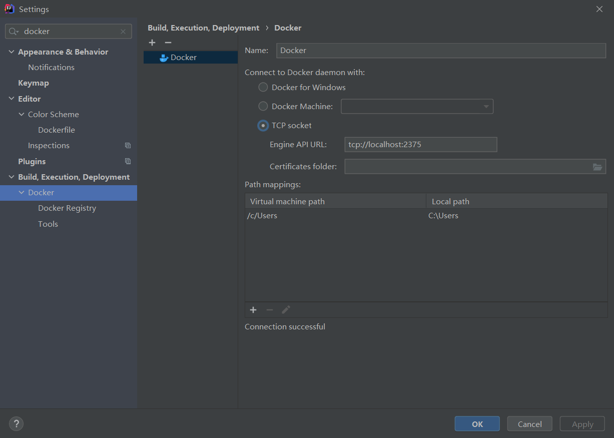
   参考[idea中安装docker插件](https://www.jianshu.com/p/b79b555e9bce)

4. 新建docker配置
   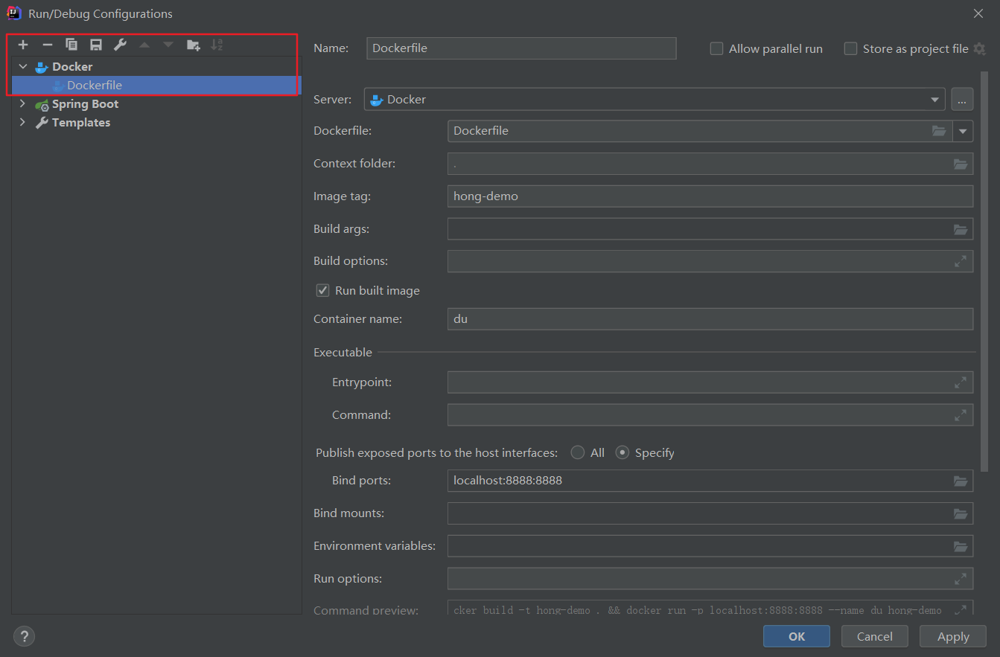
   这里可以参考[idea+springboot+dockerfile](https://www.jianshu.com/p/afab984bb3d9)

5. 运行 验证
   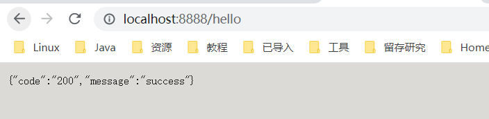

[Windows环境下通过IDEA生成镜像到本地Docker](https://www.cnblogs.com/hierarchy/articles/11908677.html)

#### 集成rabbitmq

1. 首先你得有个rabbitmq 可以本地安装 也可以在docker上安装 这都随你

2. 加入你rabbitmq的starter

```xml
<!-- RabbitMQ;)-->
<dependency>
    <groupId>org.springframework.boot</groupId>
    <artifactId>spring-boot-starter-amqp</artifactId>
</dependency>
        <!-- RabbitMQ:~ -->
```

3. 配置你的rabbitmq信息

```properties
# rabbitmq相关配置
spring.rabbitmq.host=127.0.0.1
spring.rabbitmq.port=5672
spring.rabbitmq.username=xxx
spring.rabbitmq.password=xxx
```

4. 配置rabbitmq队列

```java
/**
 * rabbitmq 配置队列
 */
@Configuration
public class RabbitConfig {

    /**
     * 定义一个名为：hong 的队列
     * @return org.springframework.amqp.core.Queue
     */
    @Bean
    public Queue hongQueue() {
        return new Queue("hong");
    }
}
```

5. 配置队列处理

```java
/**
 * 消息队列处理
 */
@Component
@RabbitListener(queues = "hong")
public class Consumer {

    Logger log = LoggerFactory.getLogger(Consumer.class);

    /**
     * @RabbitHandler 指定消息的处理方法
     * @param message
     */
    @RabbitHandler
    public void process(String message) {
        log.info("接收的消息为: {}", message);
    }
}
```

6. 启动验证

> http://127.0.0.1:9000/rabbit/hello?msg=hello,rabbitmq

> {"msg":"hello,rabbitmq已发送","code":"200"}

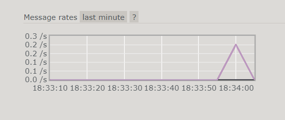
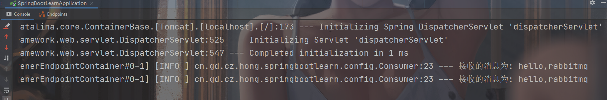

#### 单元测试

引入 spring-boot-starter-test

```xml

<dependency>
    <groupId>org.springframework.boot</groupId>
    <artifactId>spring-boot-starter-test</artifactId>
    <scope>test</scope>
</dependency>
```

启动springboot 容器测试

```java

@SpringBootTest
class SpringBootLearnApplicationTests {

    @Test
    void contextLoads() {
        System.out.println("contextLoadsd");
    }

}
```

启动springboot容器 并且调用接口测试

```java
package cn.gd.cz.hong.springbootlearn.controller;

import org.assertj.core.api.Assert;
import org.junit.jupiter.api.BeforeAll;
import org.junit.jupiter.api.BeforeEach;
import org.junit.jupiter.api.Test;
import org.springframework.beans.factory.annotation.Autowired;
import org.springframework.boot.test.context.SpringBootTest;
import org.springframework.test.context.event.annotation.BeforeTestClass;
import org.springframework.test.web.servlet.MockMvc;
import org.springframework.test.web.servlet.MvcResult;
import org.springframework.test.web.servlet.ResultActions;
import org.springframework.test.web.servlet.request.MockMvcRequestBuilders;
import org.springframework.test.web.servlet.result.MockMvcResultHandlers;
import org.springframework.test.web.servlet.result.MockMvcResultMatchers;
import org.springframework.test.web.servlet.setup.MockMvcBuilders;
import org.springframework.web.context.WebApplicationContext;

import static org.junit.jupiter.api.Assertions.*;

//SpringBootTest 是springboot 用于测试的注解，可指定启动类或者测试环境等，这里直接默认。
//因为是mock测试，在实际开发过程中，可指定其测试启动时为随机端口，避免了不必要的端口冲突。
@SpringBootTest(webEnvironment = SpringBootTest.WebEnvironment.RANDOM_PORT)
//测试单一接口时 ，也可利用注解@WebMvcTest 进行单一测试
//@WebMvcTest(DemoController.class)
class TestParamControllerTest {

    //使用 WebMvcTest 时使用
    //@autowired mockMvc 是可自动注入的。
    //当直接使用SpringBootTest 会提示 注入失败  这里直接示例利用 MockMvcBuilders工具创建
    //@Autowired
    MockMvc mockMvc;

    @Autowired
    WebApplicationContext wc;

    @BeforeEach
    public void beforeSetUp() {
        this.mockMvc = MockMvcBuilders.webAppContextSetup(wc).build();
    }

    @Test
    void simple() throws Exception {
        String id = "344698773532";
        MvcResult result = this.mockMvc
                .perform(MockMvcRequestBuilders.get("/test/param/post/simple").param("id", id))
                .andDo(MockMvcResultHandlers.print()).andExpect(MockMvcResultMatchers.status().isOk())
                .andReturn();

        //断言 是否和预期相等
        System.out.println(result.getResponse().getContentAsString());

    }
}
```

参考 [SpringBoot基础之MockMvc单元测试](https://hello.blog.csdn.net/article/details/88983708?utm_medium=distribute.pc_relevant.none-task-blog-2%7Edefault%7EBlogCommendFromMachineLearnPai2%7Edefault-3.control&depth_1-utm_source=distribute.pc_relevant.none-task-blog-2%7Edefault%7EBlogCommendFromMachineLearnPai2%7Edefault-3.control)

#### 集成thymeleaf

增加依赖

```xml
<!-- thymeleaf:> -->
<dependency>
    <groupId>org.springframework.boot</groupId>
    <artifactId>spring-boot-starter-thymeleaf</artifactId>
</dependency>
<!-- thymeleaf:~ -->
```
增加thymeleaf配置
```properties
# thymeleaf 配置
# 启用缓存:建议生产开启
spring.thymeleaf.cache=false
# 建议模版是否存在
spring.thymeleaf.check-template-location=true
# Content-Type 值
spring.thymeleaf.servlet.content-type=text/html
# 是否启用
spring.thymeleaf.enabled=true
# 模版编码
spring.thymeleaf.encoding=UTF-8
# 应该从解析中排除的视图名称列表（用逗号分隔）
spring.thymeleaf.excluded-view-names=
# 模版模式
spring.thymeleaf.mode=HTML
# 模版存放路径
spring.thymeleaf.prefix=classpath:/templates/
# 模版后缀
spring.thymeleaf.suffix=.html
```

访问层增加代码
```java
@Controller
@RequestMapping("/thymeleaf")
public class ThymeleafController {

   // 正常和springmvc设置返回参数是意义的用法了
   @GetMapping("/map")
   public String index(String name, ModelMap map) {
      map.addAttribute("name", name);
      map.addAttribute("from", "spring-boot-learn");
      // 模版名称，实际的目录为：src/main/resources/templates/thymeleaf.html
      return "thymeleaf";
   }

   @GetMapping("/mv")
   public ModelAndView index(String name) {
      ModelAndView mv = new ModelAndView();
      mv.addObject("name", name);
      mv.addObject("from", "spring-boot-learn");
      // 模版名称，实际的目录为：src/main/resources/templates/thymeleaf.html
      mv.setViewName("thymeleaf");
      return mv;
   }
}
```

在resource/templates目录下新增一个thymeleaf.html页面
```html
<!DOCTYPE html>
<html>
<head lang="en">
    <meta charset="UTF-8" />
    <title>thymeleaf简单示例</title>
</head>
<body>
<h1>Hello thymeleaf</h1>
<!-- 这里注意：拼接时 变量要单独使用${param}，其他的常量使用''包裹 -->
<h2 th:text="'名称：'+${name}+'，来自：'+${from}">默认值</h2>
</body>
</html>
```

##### 文件上传下载接口
###### 文件上传
首先确保你引入了 web starter
配置文件上传大小限制
```properties
# 文件上传配置
# 最大支持文件大小 即单个文件大小 这里的单位是bytes 下面是5M
spring.servlet.multipart.max-file-size=5242880
# 最大支持请求大小 即一次性上传的总文件大小 这里的单位是bytes 下面是10M
spring.servlet.multipart.max-request-size=10485760
```

编写控制层传文件
```java
@RestController
public class FileUploadController {
    private static final Logger log =
            LoggerFactory.getLogger(FileUploadController.class);

    @PostMapping("/upload")
    public String upload(@RequestParam MultipartFile file) throws IllegalStateException, IOException {
        // 判断是否为空文件
        if (file.isEmpty()) {
            return "上传文件不能为空";
        }
        // 文件类型
        String contentType = file.getContentType();
        // springmvc处理后的文件名
        String fileName = file.getName();
        log.info("服务器文件名：" + fileName);
        // 原文件名即上传的文件名
        String origFileName = file.getOriginalFilename();
        // 文件大小
        Long fileSize = file.getSize();

        // 保存文件
        // 可以使用二进制流直接保存
        // 这里直接使用transferTo
        file.transferTo(new File("D:\\temp\\download\\", origFileName));

        return String.format(file.getClass().getName() + "方式文件上传成功！\n文件名:%s,文件类型:%s,文件大小:%s", origFileName, contentType,fileSize);

    }
}
```

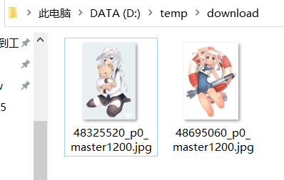
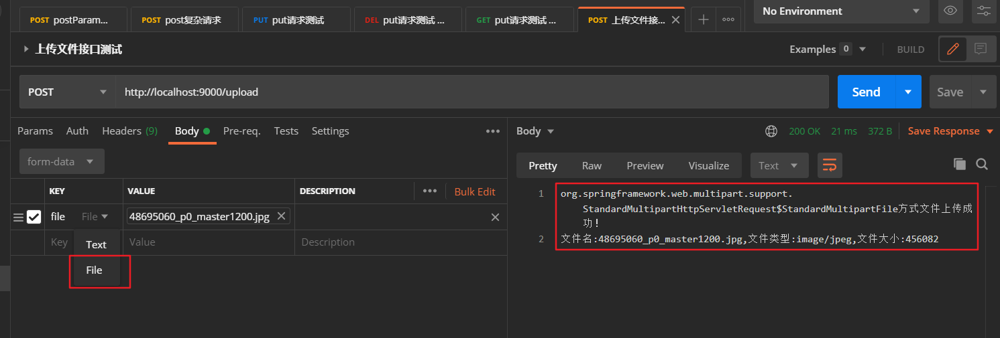

###### 文件下载
确保引入 web starter
使用ResponseEntity方式进行下载
```java
@GetMapping("/download")
    public ResponseEntity<InputStreamResource> downloadFile(Long id)
            throws IOException {
        String filePath = "D:\\documents\\photo\\secondary\\20200405/" + id + ".jpg";
        FileSystemResource file = new FileSystemResource(filePath);
        HttpHeaders headers = new HttpHeaders();
        headers.add("Cache-Control", "no-cache, no-store, must-revalidate");
        headers.add("Content-Disposition", String.format("attachment; filename=\"%s\"", file.getFilename()));
        headers.add("Pragma", "no-cache");
        headers.add("Expires", "0");

        return ResponseEntity
                .ok()
                .headers(headers)
                .contentLength(file.contentLength())
                .contentType(MediaType.parseMediaType("application/octet-stream"))
                .body(new InputStreamResource(file.getInputStream()));
    }
```

test 
> http://localhost:9000/download?id=1

完美下载图片一张

[Springboot文件下载](https://blog.csdn.net/qq415200973/article/details/51149234?utm_medium=distribute.pc_relevant.none-task-blog-2%7Edefault%7EBlogCommendFromBaidu%7Edefault-18.control&depth_1-utm_source=distribute.pc_relevant.none-task-blog-2%7Edefault%7EBlogCommendFromBaidu%7Edefault-18.control)

#### 集成websocket
加入websocket starter
不加上 配置情况下
```javascript
socket:18 WebSocket connection to 'ws://127.0.0.1:9000/my-chat/hong' failed: 
linkWebsocket @ socket:18
onclick @ socket:9
```

加了配置
```java
package cn.gd.cz.hong.springbootlearn.config;

import org.springframework.context.annotation.Bean;
import org.springframework.context.annotation.Configuration;
import org.springframework.web.socket.config.annotation.EnableWebSocket;
import org.springframework.web.socket.server.standard.ServerEndpointExporter;

/**
 * WebSocket 配置
 */
@Configuration
@EnableWebSocket
public class WebSocketConfig {
    /**
     * 会自动注册使用了@ServerEndpoint注解声明的Websocket endpoint
     * 要注意，如果使用独立的servlet容器，
     * 而不是直接使用springboot的内置容器，
     * 就不要注入ServerEndpointExporter，因为它将由容器自己提供和管理。
     */
    @Bean
    public ServerEndpointExporter serverEndpointExporter() {
        return new ServerEndpointExporter();
    }
}
```

加入控制层以及工具类代码
```java
package cn.gd.cz.hong.springbootlearn.controller;

import cn.gd.cz.hong.springbootlearn.util.WebSocketUtil;
import org.slf4j.Logger;
import org.slf4j.LoggerFactory;
import org.springframework.stereotype.Component;

import javax.websocket.*;
import javax.websocket.server.PathParam;
import javax.websocket.server.ServerEndpoint;
import java.io.IOException;

/**
 * websocket 简易聊天
 * @author hong
 *
 */
//由于是websocket 所以原本是@RestController的http形式
//直接替换成@ServerEndpoint即可，作用是一样的 就是指定一个地址
//表示定义一个websocket的Server端
@Component
@ServerEndpoint(value = "/my-chat/{usernick}")
public class WebSocketController {

    private static final Logger log =
            LoggerFactory.getLogger(WebSocketController.class);
    /**
     * 连接事件 加入注解
     * @param session
     */
    @OnOpen
    public void onOpen(@PathParam(value = "usernick") String userNick, Session session) {
        String message = "有新游客[" + userNick + "]加入聊天室!";
        log.info(message);
        WebSocketUtil.addSession(userNick, session);
        //此时可向所有的在线通知 某某某登录了聊天室
        WebSocketUtil.sendMessageForAll(message);
    }

    @OnClose
    public void onClose(@PathParam(value = "usernick") String userNick,Session session) {
        String message = "游客[" + userNick + "]退出聊天室!";
        log.info(message);
        WebSocketUtil.remoteSession(userNick);
        //此时可向所有的在线通知 某某某登录了聊天室
        WebSocketUtil.sendMessageForAll(message);
    }

    @OnMessage
    public void OnMessage(@PathParam(value = "usernick") String userNick, String message) {
        //类似群发
        String info = "游客[" + userNick + "]：" + message;
        log.info(info);
        WebSocketUtil.sendMessageForAll(message);
    }

    @OnError
    public void onError(Session session, Throwable throwable) {
        log.error("异常:", throwable);
        try {
            session.close();
        } catch (IOException e) {
            e.printStackTrace();
        }
        throwable.printStackTrace();
    }

}
```

工具类
```java
package cn.gd.cz.hong.springbootlearn.util;

import javax.websocket.RemoteEndpoint;
import javax.websocket.Session;
import java.util.Map;
import java.util.concurrent.ConcurrentHashMap;

/**
 *
 */
public class WebSocketUtil {

    /**
     * 简单使用map进行存储在线的session
     *
     */
    private static final Map<String, Session> ONLINE_SESSION = new ConcurrentHashMap<>();

    public static void addSession(String userNick,Session session) {
        //putIfAbsent 添加键—值对的时候，先判断该键值对是否已经存在
        //不存在：新增，并返回null
        //存在：不覆盖，直接返回已存在的值
//    	ONLINE_SESSION.putIfAbsent(userNick, session);
        //简单示例 不考虑复杂情况。。怎么简单怎么来了。。
        ONLINE_SESSION.put(userNick, session);
    }

    public static void remoteSession(String userNick) {
        ONLINE_SESSION.remove(userNick);
    }

    /**
     * 向某个用户发送消息
     * @param session 某一用户的session对象
     * @param message
     */
    public static void sendMessage(Session session, String message) {
        if(session == null) {
            return;
        }
        // getAsyncRemote()和getBasicRemote()异步与同步
        RemoteEndpoint.Async async = session.getAsyncRemote();
        //发送消息
        async.sendText(message);
    }

    /**
     * 向所有在线人发送消息
     * @param message
     */
    public static void sendMessageForAll(String message) {
        //jdk8 新方法
        ONLINE_SESSION.forEach((sessionId, session) -> sendMessage(session, message));
    }
}
```

##### 验证

新建一个页面
```html
<!DOCTYPE html>
<html lang="en">
<head>
    <meta charset="UTF-8">
    <title>websocket测试</title>
</head>
<body>
<label for="url">url</label><input type="text" id="url" name="url">
    <button type="button" onclick="linkWebsocket()">连接</button>
    <button type="button" onclick="closeWebsocket()">关闭</button>
    <button type="button" onclick="sendSomething()">发送</button>
</body>
<script>
    let socket;

    function linkWebsocket() {
        let url = document.getElementById("url").value;
        socket = new WebSocket(url);
    }
    function closeWebsocket() {
        socket.close();
    }
    function sendSomething() {
        socket.send("hello")
    }
</script>
</html>
```

点击 连接 退出 连接 发送 退出
有如下日志
```text
有新游客[hong]加入聊天室!
 游客[hong]退出聊天室!
有新游客[hong]加入聊天室!
游客[hong]：hello
游客[hong]退出聊天室!
```

#### 异步
##### 异步请求
同步请求：同一个请求由一个线程从头到尾进行处理 一步到位
异步请求：同一个请求中由多个线程进行处理 处理的线程先释放资源 之后通过回调机制处理

场景 红烧猪蹄 ：
高压锅压猪脚那么费时间、这个时候我们可以去做其他事情 等到猪蹄压好了再继续烹饪

如果是直接拿锅煮 不仅费时还要经常搅动 查看是否熟透 浪费时间又耗时
这个时候没有反馈机制 只能自己照看 就很麻烦
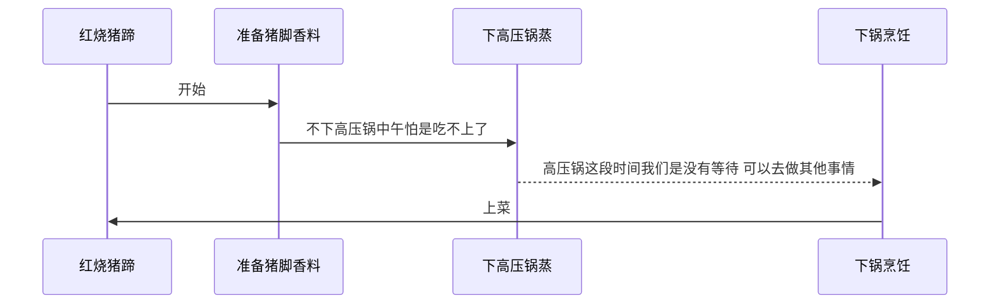

怎么搞


代码中的实现

##### 异步调用

### 配置

#### 自定义配置生成元数据

引入 spring-boot-configuration-processor jar包

可以帮助我们生成元数据 进而可以在yaml配置文件跟对应的类之间进行跳转

pom.xml 增加配置

```xml

<dependency>
    <groupId>org.springframework.boot</groupId>
    <artifactId>spring-boot-configuration-processor</artifactId>
</dependency>
```

spring-boot-configuration-processor

没有配置之前 idea 会出现 spring boot configuration annotation processor not configured

但是程序没有报错依旧可以正常使用

配置了 spring-boot-configuration-processor 之后错误消失

re-run spring boot configuration annotation processor to update generated metadata 重新运行Spring Boot配置注释处理器以更新生成的元数据

spring-boot-configuration-processor 这个组件是为了帮助我们自己配置生成元数据

可参考[spring-boot-configuration-processor的真实作用](https://blog.csdn.net/weixin_43328357/article/details/106993172)
