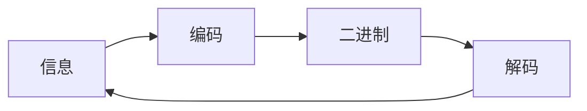

encrypt

### 前言

为了学习加密解密而创建的module

### 内容

1. 编码
2. 摘要
3. 加密

#### 编码

编码本质上是信息形式的转化。 编码的目的不是为了加密信息，是将消息转化成统一的格式，方便在不同系统之中传输。 例如最常见的ASCII字符编码。 由于网络上只能传输二进制数据，任何数据如果想要经由网络传输，就必须先转化成二进制， ASCII
提供了一个将A、B、C等字母转化为二进制的规则。

信息—>编码—>二进制—>解码—>信息

通过解码可以还原原始信息

例子：ASCII, Unicode, URL Encoding, Base64等

#### 摘要

#### 加密