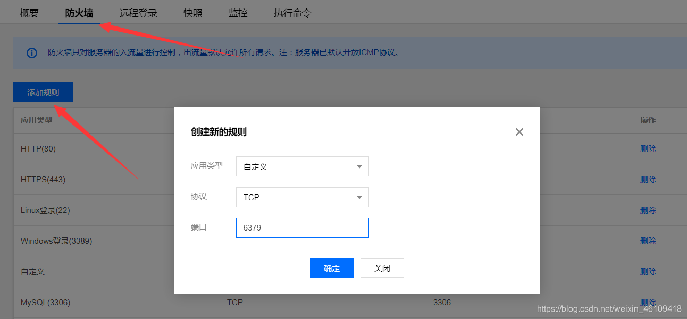

# spring-boot Redis demo

### 连接腾讯云 Redis

实验中使用的Redis 系腾讯云docker中部署的Redis 部署中需要注意的点

1. 使用自己配置的文件 redis.conf 部署Redis 此处可参
    1. [避坑外连腾讯云服务器redis 6379](https://blog.csdn.net/weixin_46109418/article/details/113200813)
    2. [解决docker容器内redis不能远程链接的问题](https://blog.csdn.net/dwwwwww/article/details/113820794?spm=1001.2101.3001.6650.1&utm_medium=distribute.pc_relevant.none-task-blog-2%7Edefault%7ELandingCtr%7Edefault-1.queryctr&depth_1-utm_source=distribute.pc_relevant.none-task-blog-2%7Edefault%7ELandingCtr%7Edefault-1.queryctr&utm_relevant_index=2)
    3. 配置文件可见 spring-boot-redis-demo/src/main/resources/bak/redis.conf
2. 此处需要放开防火墙连接
   

#### 删除容器

[删除容器](https://yeasy.gitbook.io/docker_practice/container/rm)

```bash
$ docker container rm trusting_newton
trusting_newton
```

如果要删除一个运行中的容器，可以添加 -f 参数。Docker 会发送 SIGKILL 信号给容器

### redis 配置

#### 键值自定义序列化

== important ==

- 记得mvn clean
- 记得mvn clean
- 记得mvn clean

```java
package cn.gd.cz.hong.springbootredisdemo.config;

import com.fasterxml.jackson.annotation.JsonAutoDetect;
import com.fasterxml.jackson.annotation.PropertyAccessor;
import com.fasterxml.jackson.databind.ObjectMapper;
import org.springframework.context.annotation.Bean;
import org.springframework.context.annotation.Configuration;
import org.springframework.data.redis.connection.RedisConnectionFactory;
import org.springframework.data.redis.core.RedisTemplate;
import org.springframework.data.redis.serializer.Jackson2JsonRedisSerializer;
import org.springframework.data.redis.serializer.RedisSerializer;

/**
 * 用户配置Redis序列化
 */
@Configuration
public class RedisConfig {

    @Bean
    @SuppressWarnings("all")
    public RedisTemplate<String, Object> redisTemplate(RedisConnectionFactory redisConnectionFactory) {
        RedisTemplate<String, Object> template = new RedisTemplate();
        template.setConnectionFactory(redisConnectionFactory);

        // String 序列化
        RedisSerializer<String> stringSerializer = RedisSerializer.string();
        // Json序列化配置
        Jackson2JsonRedisSerializer jackson2JsonRedisSerializer = new
                Jackson2JsonRedisSerializer(Object.class);
        ObjectMapper om = new ObjectMapper();
        om.setVisibility(PropertyAccessor.ALL, JsonAutoDetect.Visibility.ANY);
        om.enableDefaultTyping(ObjectMapper.DefaultTyping.NON_FINAL);
        jackson2JsonRedisSerializer.setObjectMapper(om);

        // 将String key 跟hash的key设置为string 序列化
        template.setKeySerializer(stringSerializer);
        template.setHashKeySerializer(stringSerializer);
        // 将string value以及hash的value使用object进行序列化
        template.setValueSerializer(jackson2JsonRedisSerializer);
        template.setHashValueSerializer(jackson2JsonRedisSerializer);

        // 设置了值之后需要重新设置变量
        template.afterPropertiesSet();

        return template;
    }
}
```

##### daemonize 守护进程

> daemonize 设置yes或者no区别 daemonize:yes:redis采用的是单进程多线程的模式。当redis.conf中选项daemonize设置成yes时，代表开启守护进程模式。在该模式下，redis会在后台运行，并将进程pid号写入至redis.conf选项pidfile设置的文件中，此时redis将一直运行，除非手动kill该进程。 daemonize:no: 当daemonize选项设置成no时，当前界面将进入redis的命令行界面，exit强制退出或者关闭连接工具(putty,xshell等)都会导致redis进程退出。

### 使用docker搭建Redis主从复制环境

搭建可参[docker实现redis主从复制](https://blog.csdn.net/gaobinzhan/article/details/103617696?spm=1001.2101.3001.6650.1&utm_medium=distribute.pc_relevant.none-task-blog-2%7Edefault%7ECTRLIST%7Edefault-1.no_search_link&depth_1-utm_source=distribute.pc_relevant.none-task-blog-2%7Edefault%7ECTRLIST%7Edefault-1.no_search_link&utm_relevant_index=2)
挂载可参[docker挂载本地目录和数据卷容器操作](https://www.jb51.net/article/200713.htm)

#### 建立一个网络

> docker network create --subnet=192.168.1.0/24 redis-network

#### 配置Redis以及启动Redis

在docker中 启动的时候记得将
> daemonize no

daemonize 改为 no 因为配置docker启动的时候 docker 参数 -d 也会使用守护进程
详情可参 [Docker部署Redis通过指定的配置文件无法正常启动？](https://blog.csdn.net/Mr_Yang__/article/details/81906691)

##### 主机配置

配置可见 src/main/resources/bak/master/redis.conf 因为这里是在容器中创建 端口可以不需要修改 依旧使用6379 但是容器启动的时候记得每个Redis一个端口

还有这里使用的是腾讯云的 所以这里需要放开IP地址

```bash
# bind 127.0.0.1
# 保护模式关闭
protected-mode no
# 修改密码
requirepass xxx
```

master

```bash
docker run -itd -p 6379:6379 --privileged=true --name redis-master --net redis-network --ip 192.168.1.2 -v /home/docker/redis/master/redis.conf:/config/redis/redis.conf  -v /home/docker/redis/master/data:/data --restart=always  redis:latest redis-server /config/redis/redis.conf
```

#### 从机配置

redis日志位置 这里使用挂载的方式
> logfile "/log/redis/redis_log/redis.log"

/home/docker/redis/slave80/redis_log/redis.log:/log/redis/redis_log/redis.log slave

这里需要配置主机的ip以及端口还有验证密码

```bash
replicaof 192.168.1.2 6379
masterauth xxx
```

不配置主机验证密码 masterauth 会出现以下错误

```log
4939:S 25 Jan 09:53:20.450 # MASTER aborted replication with an error: NOAUTH Authentication required.
4939:S 25 Jan 09:53:21.291 * Connecting to MASTER 192.168.1.2:6379
4939:S 25 Jan 09:53:21.292 * MASTER <-> SLAVE sync started
4939:S 25 Jan 09:53:21.317 * Non blocking connect for SYNC fired the event.
4939:S 25 Jan 09:53:21.342 * Master replied to PING, replication can continue...
4939:S 25 Jan 09:53:21.368 * (Non critical) Master does not understand REPLCONF listening-port: -NOAUTH Authentication required.
4939:S 25 Jan 09:53:21.393 * (Non critical) Master does not understand REPLCONF capa: -NOAUTH Authentication required.
4939:S 25 Jan 09:53:21.393 * Partial resynchronization not possible (no cached master)
4939:S 25 Jan 09:53:21.419 # Unexpected reply to PSYNC from master: -NOAUTH Authentication required.
4939:S 25 Jan 09:53:21.419 * Retrying with SYNC...
4939:S 25 Jan 09:53:21.444 # MASTER aborted replication with an error: NOAUTH Authentication required.
```

创建从机

```bash
docker run -p 6380:6379 --privileged=true --name redis_slave_80 --net redis-network --ip 192.168.1.3 -v /home/docker/redis/slave80/redis.conf:/config/redis/redis.conf  -v /home/docker/redis/slave80/data:/data -v /home/docker/redis/slave80/redis_log/redis.log:/log/redis/redis_log/redis.log  -d --restart=always  redis:latest redis-server /config/redis/redis.conf
docker run -p 6381:6379 --privileged=true --name redis_slave_81 --net redis-network --ip 192.168.1.4 -v /home/docker/redis/slave81/redis.conf:/config/redis/redis.conf  -v /home/docker/redis/slave81/data:/data -v /home/docker/redis/slave81/redis_log/redis.log:/log/redis/redis_log/redis.log -d --restart=always  redis:latest redis-server /config/redis/redis.conf
```

##### docker命令

```bash
#查看所有容器
docker ps -a
# 进入某个容器查看
docker exec -it 容器id或者容器name sh
#停用全部运行中的容器  docker kill 容器ID或容器名 :直接关闭容器
docker stop $(docker ps -q)
#删除全部容器 想强制删除可以使用 -f
docker rm $(docker ps -aq)
#Docker logs 查看实时日志  https://blog.csdn.net/jiangyu1013/article/details/96147534
docker logs -f -t --since="2017-05-31" --tail=10 edu_web_1
#  不管容器是否启动，直接重启容器
docker restart 容器ID或容器名
```

### Reference Documentation

For further reference, please consider the following sections:

* [Official Apache Maven documentation](https://maven.apache.org/guides/index.html)
* [Spring Boot Maven Plugin Reference Guide](https://docs.spring.io/spring-boot/docs/2.6.2/maven-plugin/reference/html/)
* [Create an OCI image](https://docs.spring.io/spring-boot/docs/2.6.2/maven-plugin/reference/html/#build-image)
* [Spring Configuration Processor](https://docs.spring.io/spring-boot/docs/2.6.2/reference/htmlsingle/#configuration-metadata-annotation-processor)
* [Spring Boot DevTools](https://docs.spring.io/spring-boot/docs/2.6.2/reference/htmlsingle/#using-boot-devtools)
* [Spring Data Redis (Access+Driver)](https://docs.spring.io/spring-boot/docs/2.6.2/reference/htmlsingle/#boot-features-redis)

### Guides

The following guides illustrate how to use some features concretely:

* [Messaging with Redis](https://spring.io/guides/gs/messaging-redis/)